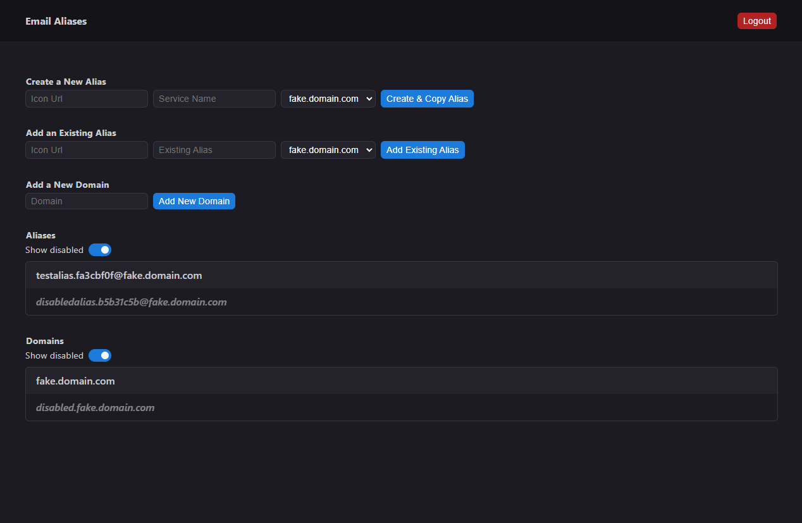

# Email Alias Manager
This is a simple tool I made using Golang. It manages email aliases for a catch-all domain I have configured. It allows me to create aliases in the format I desire, while managing them in a database so I dont lose track of email addresses.

## Docker
This can be deployed using Docker, this is how I use it. You will need to build the docker file to get a working image as I have not uploaded this to the Docker Registry.

## Environment Variables
- `CRYPTO_PEPPER`: a random string added to all operations, its like a salt but global to the whole database
- `SQLITE_DATABASE_PATH`: the path for the sqlite database path
- `SERVER_ADDRESS`: the address of the server, by default its `:4041` but can be anything.

## Screenshot
